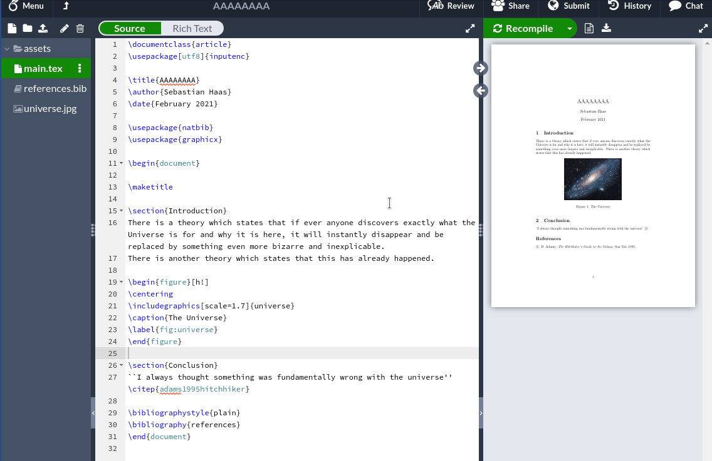

# Overleaf-Image-Helper

## Description
Overleaf currently does allow you to upload images only with their upload button.

The purpose of this project is to provide a convenient way to insert images into Overleaf without menus by just using `ctrl+v`.  
I wrote this as Tampermonkey script for Chrome/Chromium and Firefox. The script will create an asset folder in your project root folder and reference images in as LaTeX figures with captions, which you can directly edit after pasting the image.

## Fork
This fork intends to make this great tampermonkey script into a native Firefox Add-on. I use this quite a lot, and I think others that are uneasy with userscripts/tampermonkey will find it useful.

## Demo

## Installation

1. Clone the project
2. Go to about:debugging -> This Firefox
3. Load Temporary Add-on
4. Reload the Add-on when changes are made
